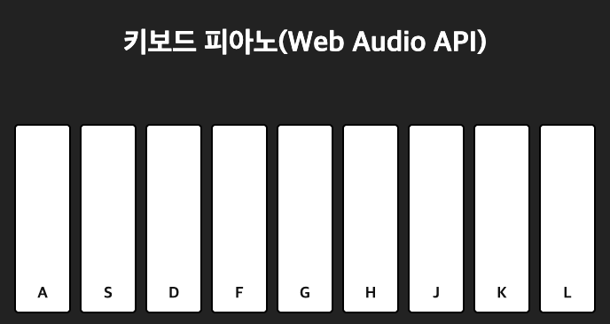

# 🎹 Web Piano (Keyboard Piano)

브라우저에서 키보드를 이용해 연주할 수 있는 **간단한 웹 피아노** 프로젝트  
[**Web Audio API**](https://developer.mozilla.org/ko/docs/Web/API/Web_Audio_API)를 사용하여 실시간으로 소리를 생성하고, 건반 클릭과 키보드 입력 모두 지원

---

## 🖼️ 화면 구성

  
사이트: http://buildenough.shop/piano

---

## 🚀 기능

- 키보드 입력으로 피아노 연주 (A~L 키)
- 클릭으로 피아노 건반 연주 가능
- 키보드 누를 때 시각적 하이라이트
- Web Audio API를 이용한 실제 피아노 톤 생성
- 반응형 레이아웃 (화면 중앙 정렬)

---

## 💻 기술 스택

- **HTML5 / CSS3 / JavaScript**
- **JAVA 21**
- **Web Audio API** (실시간 오디오 생성)
- **Spring Boot** (옵션, 서버 환경에서 실행 가능)

### Dependencies
- **Spring Web**
- **Thymeleaf**
- **Lombok** (굳이 필요 없긴함)
- **Spring Boot DevTools**

---

## 🎵 사용 예시

- A 키 → 도(C4)
- S 키 → 레(D4)
- D 키 → 미(E4)
- …
- L 키 → 레(D5)

